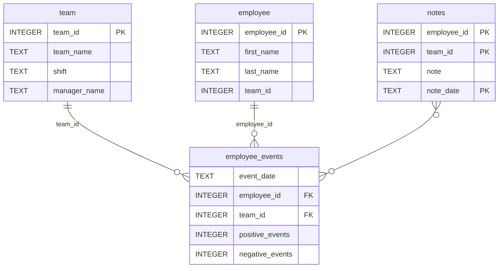

# Software Engineering for Data Scientists 

This repository contains starter code for the **Software Engineering for Data Scientists** final project. Please reference your course materials for documentation on this repository's structure and important files. Happy coding!

### Repository Structure
```
├── README.md
├── assets
│   ├── model.pkl
│   └── report.css
├── env
├── python-package
│   ├── employee_events
│   │   ├── __init__.py
│   │   ├── employee.py
│   │   ├── employee_events.db
│   │   ├── query_base.py
│   │   ├── sql_execution.py
│   │   └── team.py
│   ├── requirements.txt
│   ├── setup.py
├── report
│   ├── base_components
│   │   ├── __init__.py
│   │   ├── base_component.py
│   │   ├── data_table.py
│   │   ├── dropdown.py
│   │   ├── matplotlib_viz.py
│   │   └── radio.py
│   ├── combined_components
│   │   ├── __init__.py
│   │   ├── combined_component.py
│   │   └── form_group.py
│   ├── dashboard.py
│   └── utils.py
├── requirements.txt
├── start
├── tests
    └── test_employee_events.py
```

### employee_events.db



## Project Summary

This repository implements a data-driven dashboard using FastHTML. The dashboard can be used to monitor an employee's performance and their predicted risk of recruitment by other companies.

**Technologies & Packages Used:**
- **Python**: Main programming language for backend logic and data processing.
- **SQLite**: Used for storing and querying employee, team, and event data (`employee_events.db`).
- **pandas**: For data manipulation and SQL query results handling.
- **matplotlib**: For generating visualizations (line charts and bar charts) displayed on the dashboard.
- **FastHTML**: Framework for building and serving the interactive dashboard web application and handling routes.
- **scikit-learn**: Used for loading and running the recruitment risk prediction model (`model.pkl`).

## Dashboard Components

The FastHTML dashboard page displays the following information:

- **Header**: Shows the name of the selected employee or team.
- **Dashboard Filters**: Allows users to select between Employee or Team profiles and choose a specific entity from a dropdown.
- **Visualizations**:
  - **Line Chart**: Displays cumulative counts of positive and negative events by date for the selected employee or team.
  - **Bar Chart**: Shows the predicted recruitment risk for the selected entity, based on the machine learning model.
- **Notes Table**: Lists notes associated with the selected employee or team, including note dates and content.

## File Descriptions

### python-package
- **__init__.py**: Exposes main classes and functions for package import.
- **employee.py**: Defines the `Employee` class for employee-related SQL queries and logic.
- **employee_events.db**: SQLite database containing all project data.
- **query_base.py**: Base class for database queries, inherited by Team and Employee Classes.
- **sql_execution.py**: Mixin and utility functions for executing SQL queries and returning results.
- **team.py**: Defines the `Team` class for team-related SQL queries and logic.
- **setup.py**: Package setup configuration for installing employee_events package.

### report/base_components/
- **__init__.py**: Initializes the base components module.
- **base_component.py**: Contains base_component class code with functions.
- **data_table.py**: Table for displaying notes and other table data.
- **dropdown.py**: Dropdown for selecting either employees or teams.
- **matplotlib_viz.py**: Class for matplotlib visualizations.
- **radio.py**: Radio button component for selecting Employee or Team.

### report/combined_components/
- **__init__.py**: Initializes the combined components module.
- **combined_component.py**: Contains combined_component class code with functions.
- **form_group.py**: Class for form related functions.

### report/
- **dashboard.py**: Main FastHTML dashboard code used to display information to HTML page.
- **utils.py**: Contains route to pkl file and loads the model used to predict the recruitment risk.

### tests/
- **test_employee_events.py**: Contains unit tests to test different aspects of the project.

## FastHTML Routes

### `/` (GET)
- **Description**: Renders the main dashboard for the default employee (ID 1). Displays header, filters, visualizations, and notes.

### `/employee/{employee_id}` (GET)
- **Description**: Renders the dashboard for a specific employee by ID. Displays all relevant data and visualizations for that employee.

### `/team/{team_id}` (GET)
- **Description**: Renders the dashboard for a specific team by ID. Displays all relevant data and visualizations for that team.

### `/update_dropdown{r}` (GET)
- **Description**: Updates the dropdown selector based on the selected profile type (Employee or Team).

### `/update_data` (POST)
- **Description**: Handles form submission changes.


